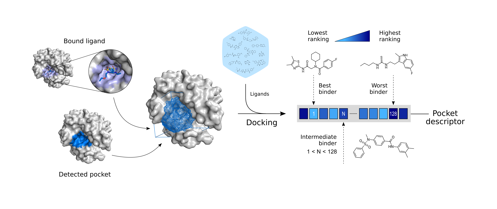

# PocketVec

Pocket descriptors characterize protein binding sites in the shape of numerical vectors, which enable the high-throughput exploration of the pocket space.

**PocketVec** is a novel strategy to generate protein binding site descriptors based on the assumption that similar pockets bind similar ligands. The approach is built upon inverse virtual screening (docking): the prioritization of a predefined set of small molecules is expected to be more correlated between a pair of similar pockets than between a pair of dissimilar ones. In short, each pocket is represented by the set of numerical ranks provided by small molecules in docking calculations. Further conceptual and methodological details are best described in the original PocketVec publication: [REF]. 

The **PocketVec Repository** holds the code needed to create a PocketVec descriptor for any protein binding site of interest together with all results presented along the manuscript. The directory structure is specified as follows:

* `code`: funcions, scripts and notebooks to generate PocketVec descriptors. 
* `data`: sets of small molecules to dock.
* `examples`: example exercises. Check section `Basic usage` for further details. 
* `results`: PocketVec paper results.

# Installation

1. Clone this repository to your local PocketVec folder:
        
        cd ~ && mkdir -p pocketvec && cd pocketvec
        git clone https://gitlabsbnb.irbbarcelona.org/acomajuncosa/pocketvec.git

2. Create and activate a conda environment with all the requirements:

        conda env create --name pocketvec_env --file=environment.yml
        conda activate pocketvec_env

# Running PocketVec

Once the _pocketvec_env_ conda environment has been activated, running PocketVec is as simple as:

        python pocketvec_main.py --receptor <PATH_TO_RECEPTOR> --pocket_centroid <PATH_TO_POCKET_CENTROID> --output <PATH_TO_OUTPUT>

* `<PATH_TO_RECEPTOR>`: Path to protein receptor. Should be in MOL2 format and ready for docking. 
        Example: `./run_pocketvec/1A42_prepared.mol2`
* `<PATH_TO_POCKET_CENTROID>`: Path to pocket centroid. We typically represent it as a single C atom with 3D cordinates (pocket centroid) in a SD file. 
        Example: `./run_pocketvec/CTR_LIG.sd`
* `<PATH_TO_OUTPUT>`: Output path. All files generated along the PocketVec descriptor calculation will be left here. 
        Example: `./run_pocketvec`

Optional parameters such as the number of docking runs (--n_runs) and the radius of defined cavities (--radius) can also be specified. To check all available options:

        python pocketvec_main.py --help

# Speed

PocketVec is built upon inverse virtual screening -its computational cost is mainly due to docking calculations. The number of rDock runs is thus the primary factor that determines the speed of PocketVec characterization. With 25 (default) docking runs for 128 lead-like molecules, the PocketVec pipeline should not exceed 1 hour of computing time in a single CPU. 

# Basic usage

We have prepared 3 Jupyter Notebooks to further illustrate and exemplify typical scenarios involving PocketVec descriptors.

1. Protein and pocket centroid preparation: Given a PDB code (and chain), the notebook shows how to download, process and prepare the receptor structure for docking calculations. In addition, we show how to specify pocket centroids using bound ligands and pocket detection algorithms.

2. Running PocketVec step by step: Given a prepared receptor structure (MOL2) and a pocket centroid (SD), rDock calculations are performed to build PocketVec descriptors (np.array stored in a pickle file). 

3. Looking for pockets having similar PocketVec descriptors to a given pocket query: Given a PocketVec descriptor (np.array stored in a pickle file), we show how to perform pairwise comparisons with all pockets characterized in the Human Proteome.

# External dependencies

The complete generation of PocketVec descriptors relies on external software specifically designed for certain tasks.

* [rDock](https://rdock.sourceforge.net/): Docking calculations. We provide a pre-compiled version of rDock in `code/utils/rDock_compiled/`, but this may not suite most of the machines. If this is your case, please consider installing it from [scratch](https://rdock.sourceforge.net/installation/) and changing the --rDock parameter when running PocketVec.
* [BioBB Structure Checking](https://pypi.org/project/biobb-structure-checking/): Protein preparation.
* [MOE](https://www.chemcomp.com/): Protein preparation.
* [OpenBabel](https://github.com/openbabel/openbabel): Protein and Pocket preparation. 
* [Fpocket](https://github.com/Discngine/fpocket): Pocket detection and scoring.
* [P2rank](https://github.com/rdk/p2rank): Pocket detection and scoring.

# Citation

[REF]

<!-- [PyPI](https://pypi.org/project/chemicalchecker/#history)  -->
